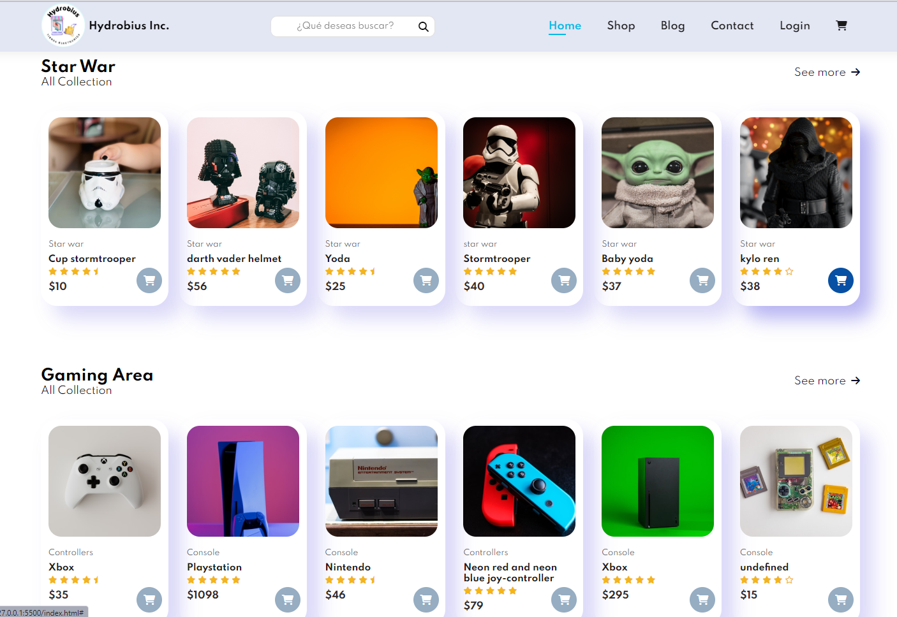

# Challenge Oracle e-Commerce

Challenge Oracle One tienda virtual

Challenge de [Alura Latam](https://www.aluracursos.com/) otorgada por el programa [Oracle Next Education](https://www.oracle.com/mx/education/oracle-next-education/).

---

entre los **Requisitos** estaban:

* [x] Una página de inicio que contiene un botón de inicio de sesión y un motor de búsqueda de productos ofrecidos por la empresa.
* [x] Un banner que contenga descuentos, promociones o informaciónes relevante del momento.
* [x] Una galería con información del producto, como imagen, nombre del producto, precio y un enlace a la página de descripción del producto.
* [x] Una página de producto que contiene la imagen, el nombre, la descripción y el precio.
* [x] Un pie de página con un formulario de contacto y otras informaciónes relevantes.
* [x] Un formulário de iniciar sesión para autenticar a los usuarios que quieran acceder al menu administrador.
* [x] Menú de administrador para que puedan agregar, editar, buscar o eliminar productos de la tienda.

**Página de la práctica, en el siguiente enlace** [link](https://hydr0bius.github.io/Challenge-Oracle-eCommerce/)

---

